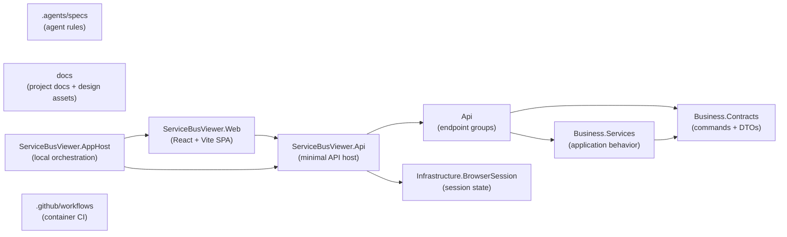

# ServiceBusViewer — Project Structure

## Folder Structure

```text
ServiceBusViewer.sln
│
├─ .agents/                                  <-- Agent-specific repository instructions and supporting guidance
│  └─ specs/                                 <-- Contributor/agent conventions and implementation guidance
│     └─ CSHARP_CODESTYLE.md                 <-- Agent/contributor C# conventions
│
├─ .github/                                  <-- GitHub automation and repository-level platform configuration
│  └─ workflows/                             <-- Container-image CI workflows
│
├─ docs/                                     <-- Project documentation and design references for the product/repository
│  └─ design/                                <-- Design/reference images and HTML mockup assets
│
├─ src/                                      <-- Application source
│  ├─ ServiceBusViewer/                      <-- Backend API project, owns HTTP API, business logic, and browser-session state.
│  │  ├─ Api/                                <-- HTTP boundary; keep minimal API handlers thin and delegate to `Business\Services`
│  │  │  ├─ Endpoints/                       <-- Minimal API endpoint groups organized by feature area
│  │  │  │  ├─ Bootstrap/                    <-- Initial application bootstrap payload
│  │  │  │  ├─ Connection/                   <-- Connect/disconnect endpoints
│  │  │  │  ├─ Entities/                     <-- Queue/topic/subscription details endpoints
│  │  │  │  └─ Viewer/                       <-- Viewer state, receive, refresh, select, and send endpoints
│  │  │  └─ Models/                          <-- API-facing models used at the HTTP boundary
│  │  ├─ Business/                           <-- Backend business layer split into contracts and implementations
│  │  │  ├─ Contracts/                       <-- Application contracts, commands, queries, and DTOs
│  │  │  │  ├─ ServiceBus/                   <-- Service Bus domain DTOs and message/property contracts
│  │  │  │  └─ Viewer/                       <-- Viewer commands, queries, and state contracts
│  │  │  └─ Services/                        <-- Backend business-service implementations and connection management
│  │  ├─ Infrastructure/                     <-- Backend infrastructure concerns outside the HTTP/business layers
│  │  │  └─ BrowserSession/                  <-- Browser-session isolation and state scoped to the session cookie
│  │  └─ Dockerfile                          <-- Backend container image
│  │
│  ├─ ServiceBusViewer.Web/                  <-- Frontend SPA project, focused on UI, client state, and `/api` integration.
│  │  ├─ src/                                <-- Frontend code organized by API access, UI components, hooks/utilities, pages, state, and types
│  │  │  ├─ api/                             <-- Frontend API access layer for calling backend endpoints
│  │  │  │  └─ serviceBusApi.ts              <-- Frontend API client for backend endpoints
│  │  │  ├─ components/                      <-- Reusable UI components grouped by responsibility
│  │  │  │  ├─ common/                       <-- Shared UI primitives
│  │  │  │  ├─ details/                      <-- Entity/message detail rendering
│  │  │  │  ├─ entities/                     <-- Entity list/sidebar UI
│  │  │  │  ├─ layout/                       <-- App shell and shared layout wiring
│  │  │  │  └─ viewer/                       <-- Viewer-specific interaction components
│  │  │  ├─ hooks/                           <-- Reusable React hooks
│  │  │  ├─ lib/                             <-- UI helpers, formatters, JSON formatting, problem-details mapping
│  │  │  ├─ pages/                           <-- Route-level page components
│  │  │  ├─ state/                           <-- Shared frontend state and context wiring
│  │  │  │  └─ AppStateContext.tsx           <-- Shared application state/context
│  │  │  └─ types/                           <-- Frontend TypeScript types for Service Bus viewer data
│  │  │     └─ serviceBus.ts                 <-- Frontend TypeScript domain types
│  │  ├─ public/                             <-- Static assets served by Vite
│  │  ├─ nginx/                              <-- Frontend container reverse-proxy assets that must stay aligned with `/api` routing
│  │  │  └─ default.conf.template            <-- SPA container reverse-proxy config for `/api`
│  │  ├─ vite.config.ts                      <-- Vite dev server and `/api` proxy configuration
│  │  └─ Dockerfile                          <-- Frontend container image; keep runtime ports and env contracts aligned with the SPA
│  │
│  └─ ServiceBusViewer.AppHost/              <-- Local orchestration project for emulator, SQL storage, API, and SPA dev server; not for business logic
│     ├─ AppHost.cs                          <-- Aspire/AppHost orchestration for emulator, SQL, API, and SPA
│     └─ ServiceBusConfig.json               <-- Azure Service Bus emulator configuration mounted into the container
│
├─ README.md                                 <-- Product overview, run instructions, and version history
├─ package.json                              <-- Repo-level scripts delegating to the SPA project
└─ package-lock.json
```

---

## Dependency Rules

| Project / Layer | Can Depend On | Must Not Depend On | Notes |
| --- | --- | --- | --- |
| `.agents/specs` | Markdown documentation only | Production source code | Stores agent-facing rules and code-style guidance. |
| `docs` | Markdown and design assets | Production source code | Holds repository/project documentation only. |
| `src\ServiceBusViewer\Api` | `Business\Contracts`, `Business\Services`, API/infrastructure helpers | Frontend code | Keep handlers thin: validate, delegate, map HTTP responses. |
| `src\ServiceBusViewer\Business\Contracts` | BCL, Azure SDK models when needed | API endpoint handlers, frontend code | Defines backend-facing commands, queries, DTOs, and state shapes. |
| `src\ServiceBusViewer\Business\Services` | `Business\Contracts`, infrastructure needed for Service Bus access | API endpoint handlers, frontend code | Owns application behavior and Service Bus workflows. |
| `src\ServiceBusViewer\Infrastructure` | Backend project internals and framework primitives | Frontend code | Contains browser-session state plumbing and related helpers. |
| `src\ServiceBusViewer.Web` | Browser libraries, React, local frontend utilities | Backend internals | Talks to the backend only through `/api`. |
| `src\ServiceBusViewer.AppHost` | Aspire hosting model, project references, emulator/container config | Frontend/backend internal implementation details | Orchestrates local development resources; it should not absorb product logic. |
| `.github/workflows` | Docker build/publish assets and repository files | Application runtime logic | CI/CD automation only. |

--- 

## Key Principles Reflected

### Split application boundaries stay explicit

The solution is intentionally divided into backend, frontend, and local-orchestration projects. Keep ownership clear: backend behavior belongs in `src\ServiceBusViewer`, UI/client behavior belongs in `src\ServiceBusViewer.Web`, and local environment wiring belongs in `src\ServiceBusViewer.AppHost`.

### Minimal API handlers stay thin

`Api` is the HTTP boundary only. Handlers should validate input, call `Business\Services`, and map results to HTTP responses instead of owning business logic directly.

### `Business\Contracts` is the backend contract boundary

Commands, queries, DTOs, and viewer state shapes belong in `src\ServiceBusViewer\Business\Contracts`. Avoid creating parallel request/result models in unrelated backend layers when an existing contract boundary already exists.

### Browser-session isolation is a core runtime behavior

Viewer state and Service Bus connection state are intentionally isolated per browser session through the `sbv-session` cookie and the browser-session registry/middleware. New features should preserve that isolation rather than introducing shared singleton state for user data.

### Frontend and backend communicate through `/api`

`src\ServiceBusViewer.Web` should depend on backend HTTP contracts exposed via `/api`, not backend implementation details or shared internal abstractions. Keep frontend API access centralized in the frontend API layer.

### AppHost and container assets are configuration boundaries

`src\ServiceBusViewer.AppHost`, Dockerfiles, nginx config, and emulator configuration are part of the runtime/development wiring. Changes to ports, environment variables, `/api` routing, or startup assumptions should keep all of these assets aligned.

### Validation is currently manual

The repository currently has no automated tests, so changes should be validated with targeted manual checks that match the behavior being changed.

---

## Dependency Diagram


