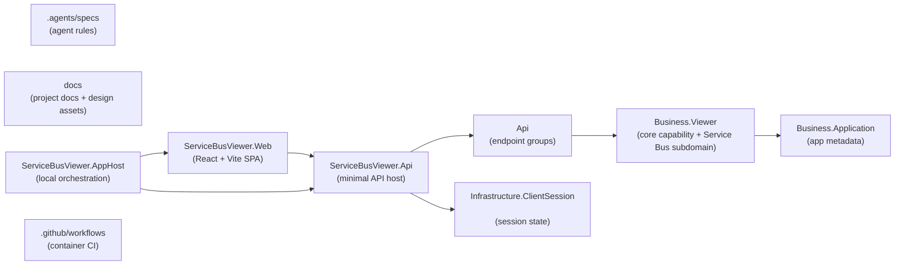

# ServiceBusViewer — Project Structure

## Folder Structure

```text
ServiceBusViewer.sln
│
├─ .agents/                                  <-- Agent-specific repository instructions and supporting guidance
│  └─ specs/                                 <-- Contributor/agent conventions and implementation guidance
│     └─ CSHARP_CODESTYLE.md                 <-- Agent/contributor C# conventions
│
├─ .github/                                  <-- GitHub automation and repository-level platform configuration
│  └─ workflows/                             <-- Container-image CI workflows
│
├─ docs/                                     <-- Project documentation and design references for the product/repository
│  └─ design/                                <-- Design/reference images and HTML mockup assets
│
├─ src/                                      <-- Application source
│  ├─ ServiceBusViewer/                      <-- Backend API project, owns HTTP API, business logic, and browser-session state.
│  │  ├─ Api/                                <-- HTTP boundary; keep minimal API handlers thin and delegate to business slice services
│  │  │  ├─ ExceptionHandling/                <-- Central exception classification and RFC ProblemDetails responses
│  │  │  ├─ Endpoints/                       <-- Minimal API endpoint groups organized by feature area
│  │  │  │  ├─ SessionState/                 <-- Initial session-state payload for the current browser session
│  │  │  │  ├─ Connection/                   <-- Connect/disconnect endpoints
│  │  │  │  ├─ Entities/                     <-- Queue/topic/subscription details endpoints
│  │  │  │  └─ Viewer/                       <-- Viewer state, receive, refresh, select, and send endpoints
│  │  │  └─ Models/                          <-- API-facing models used at the HTTP boundary
│  │  ├─ Business/                           <-- Backend business layer organized by business capability rather than global type buckets
│  │  │  ├─ Application/                     <-- Application-wide metadata such as version/build information
│  │  │  │  ├─ Contracts/                    <-- Application-facing interfaces for app metadata
│  │  │  │  └─ Services/                     <-- Implementations of application metadata providers
│  │  │  └─ Viewer/                          <-- Core Service Bus viewer capability: use cases, state, and Service Bus subdomain contracts
│  │  │     ├─ Contracts/                    <-- Viewer DTOs and use-case interfaces consumed by the API layer
│  │  │     │  └─ ServiceBus/                <-- Service Bus entity, message, property, and rule models owned by the Service Bus Viewer domain
│  │  │     ├─ Dependencies/                 <-- Viewer-owned ports such as session state and Service Bus connection abstractions
│  │  │     └─ Services/                     <-- Viewer business implementations and internal mapping helpers
│  │  ├─ Infrastructure/                     <-- Backend infrastructure concerns outside the HTTP/business layers
│  │  │  ├─ ClientSession/                   <-- Client-session isolation and state scoped to the session cookie
│  │  │  └─ ServiceBus/                      <-- Azure Service Bus and other technical implementations that satisfy business-defined dependencies
│  │  └─ Dockerfile                          <-- Multi-stage build for the combined SPA and API container image
│  │
│  ├─ ServiceBusViewer.Web/                  <-- Frontend SPA project, focused on UI, client state, and `/api` integration.
│  │  ├─ src/                                <-- Frontend code organized by API access, UI components, hooks/utilities, pages, state, and types
│  │  │  ├─ api/                             <-- Frontend API access layer for calling backend endpoints
│  │  │  │  └─ serviceBusApi.ts              <-- Frontend API client for backend endpoints
│  │  │  ├─ components/                      <-- Reusable UI components grouped by responsibility
│  │  │  │  ├─ common/                       <-- Shared UI primitives
│  │  │  │  ├─ details/                      <-- Entity/message detail rendering
│  │  │  │  ├─ entities/                     <-- Entity list/sidebar UI
│  │  │  │  ├─ layout/                       <-- App shell and shared layout wiring
│  │  │  │  └─ viewer/                       <-- Viewer-specific interaction components
│  │  │  ├─ hooks/                           <-- Reusable React hooks
│  │  │  ├─ lib/                             <-- UI helpers, formatters, JSON formatting, problem-details mapping
│  │  │  ├─ pages/                           <-- Route-level page components
│  │  │  ├─ state/                           <-- Shared frontend state and context wiring
│  │  │  │  └─ AppStateContext.tsx           <-- Shared application state/context
│  │  │  └─ types/                           <-- Frontend TypeScript types for Service Bus viewer data
│  │  │     └─ serviceBus.ts                 <-- Frontend TypeScript domain types
│  │  ├─ public/                             <-- Static assets served by Vite
│  │  └─ vite.config.ts                      <-- Vite dev server and `/api` proxy configuration for local development
│  │
│  └─ ServiceBusViewer.AppHost/              <-- Local orchestration project for emulator, SQL storage, API, and SPA dev server; not for business logic
│     ├─ AppHost.cs                          <-- Aspire/AppHost orchestration for emulator, SQL, API, and SPA
│     └─ ServiceBusConfig.json               <-- Azure Service Bus emulator configuration mounted into the container
│
├─ README.md                                 <-- Product overview, run instructions, and version history
├─ package.json                              <-- Repo-level scripts delegating to the SPA project
└─ package-lock.json
```

---

## Dependency Rules

| Project / Layer | Can Depend On | Must Not Depend On | Notes |
| --- | --- | --- | --- |
| `.agents/specs` | Markdown documentation only | Production source code | Stores agent-facing rules and code-style guidance. |
| `docs` | Markdown and design assets | Production source code | Holds repository/project documentation only. |
| `src\ServiceBusViewer\Api` | `Business\Application\Contracts`, `Business\Viewer\Contracts`, API/infrastructure helpers | Frontend code | Keep handlers thin: validate, delegate, map HTTP responses. |
| `src\ServiceBusViewer\Business\Application` | BCL | API endpoint handlers, frontend code, concrete infrastructure implementations | Holds application-level metadata contracts and implementations. |
| `src\ServiceBusViewer\Business\Viewer` | `Business\Application\Contracts`, BCL, Azure SDK models when needed, viewer-owned dependencies | API endpoint handlers, frontend code, concrete infrastructure implementations | Owns the core Service Bus Viewer domain: viewer use cases, UI-facing state, Service Bus-shaped contracts, and viewer-owned ports that infrastructure implements. |
| `src\ServiceBusViewer\Infrastructure` | Backend project internals, Azure SDK clients, framework primitives, business-defined abstractions when implementing them | Frontend code, business policy | Contains technical implementations and adapters for the dependencies required by the business layer. |
| `src\ServiceBusViewer.Web` | Browser libraries, React, local frontend utilities | Backend internals | Talks to the backend only through `/api`. |
| `src\ServiceBusViewer.AppHost` | Aspire hosting model, project references, emulator/container config | Frontend/backend internal implementation details | Orchestrates local development resources; it should not absorb product logic. |
| `.github/workflows` | Docker build/publish assets and repository files | Application runtime logic | CI/CD automation only. |

--- 

## Key Principles Reflected

### Application boundaries stay explicit

The solution is intentionally divided into backend, frontend, and local-orchestration projects. Keep ownership clear: backend behavior belongs in `src\ServiceBusViewer`, UI/client behavior belongs in `src\ServiceBusViewer.Web`, and local environment wiring belongs in `src\ServiceBusViewer.AppHost`. This source-level split is preserved even though production deployment uses one container.

### Minimal API handlers stay thin

`Api` is the HTTP boundary only. Handlers should validate input, call the appropriate business slice service, and map results to HTTP responses instead of owning business logic directly.

Unhandled endpoint exceptions are classified centrally by the API exception handler and written through `IProblemDetailsService` as `application/problem+json`. Known connection-state, request-format, and Service Bus errors may expose actionable details; unexpected failures use a sanitized `500` detail and are logged server-side without exposing exception messages or stack traces to the browser. Validation problems retain their field-level `errors` object.

### Business is organized by capability first

The business layer is intentionally sliced by capability under `Application` and `Viewer`. `Viewer` is the core product capability, and its `Contracts\ServiceBus` folder is treated as a Viewer subdomain rather than a separate peer business slice. Prefer putting related contracts, dependencies, and implementations beside each other within that capability rather than creating global folders that mix unrelated concerns.

### Viewer owns the Service Bus subdomain

This application is a **Service Bus Viewer**, not a generic viewer plus a separate Service Bus business module. Service Bus entities, messages, rules, and message properties are therefore part of the Viewer domain model. Viewer-owned dependencies such as `IServiceBusConnection` may depend on those contracts without crossing into another peer business boundary.

### Business defines dependency needs; Infrastructure implements them

The business layer should describe the collaborators it needs through abstractions in the owning capability slice and depend on those abstractions rather than concrete technical code. Infrastructure exists to implement those dependencies using Azure SDK clients, framework services, and other runtime details without pulling business policy into the infrastructure layer.

### Browser-session isolation is a core runtime behavior

Viewer state and Service Bus connection state are intentionally isolated per browser session through the `sbv-session` cookie and the browser-session registry/middleware. New features should preserve that isolation rather than introducing shared singleton state for user data.

### Frontend and backend communicate through `/api`

`src\ServiceBusViewer.Web` should depend on backend HTTP contracts exposed via `/api`, not backend implementation details or shared internal abstractions. Keep frontend API access centralized in the frontend API layer. Vite proxies `/api` to the separately running API during local development; the combined container serves both from the ASP.NET Core host on port `8080`.

### AppHost and container assets are configuration boundaries

`src\ServiceBusViewer.AppHost`, the combined-image Dockerfile, and emulator configuration are part of the runtime/development wiring. The AppHost continues to run Vite and the API as separate resources for local development. The Dockerfile builds the SPA, publishes the API, and places the SPA bundle in the published application's `wwwroot`; the final image contains only the ASP.NET Core runtime. Changes to ports, environment variables, `/api` routing, or startup assumptions should keep these assets aligned.

### Validation is currently manual

The repository currently has no automated tests, so changes should be validated with targeted manual checks that match the behavior being changed.

---

## Dependency Diagram


